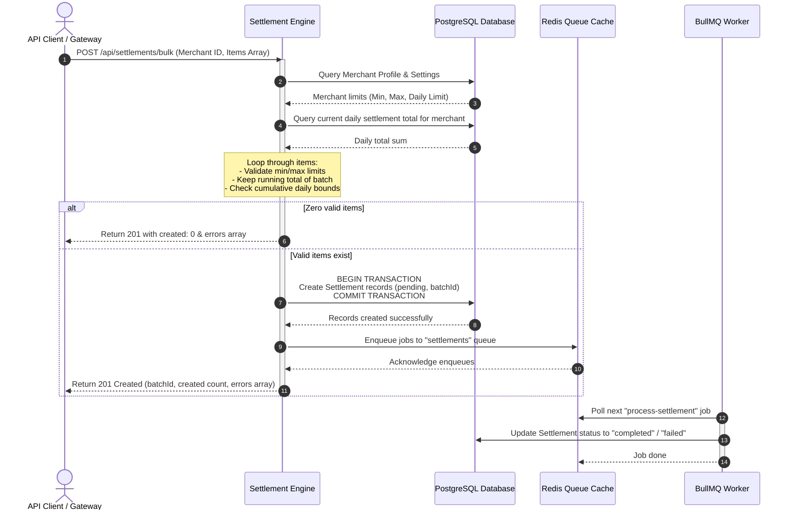

# Bulk Settlements Architecture & Operations Guide

This document details the architecture, request life cycle, validation rules, data persistence, and background processing models of the Bulk Settlements feature in the BettaPay Settlement Engine.

---

## 1. Feature Overview

Merchants operating at high volumes require the ability to settle multiple payouts or payments simultaneously to minimize API latency and simplify integration logic. 

The bulk settlements feature introduces:
1. **Atomic Batch Validation**: Evaluates limit constraints dynamically against merchant settings and cumulative daily histories before write-time.
2. **Asynchronous Processing**: Converts individual settlement items into separate BullMQ queue jobs to allow independent retry, rate-limiting, and error isolation.
3. **Progress Tracking**: Exposes a status endpoint to trace the progress of items sharing a batch identifier.

---

## 2. Sequence Workflow

The diagram below represents the end-to-end request flow for a bulk settlement request:



---

## 3. Detailed Endpoint Specs

### 3.1 Create Bulk Settlements
* **Route**: `POST /api/settlements/bulk`
* **Content-Type**: `application/json`
* **Body Schema**:
```json
{
  "merchantId": "GBRPYHIL...",
  "settlements": [
    { "amount": "150.00", "asset": "USDC" },
    { "amount": "250.50", "asset": "USDC" }
  ]
}
```

#### Response (Success / Partial Success)
* **Status**: `201 Created`
* **Payload**:
```json
{
  "batchId": "batch_8fa9a12c8b9148b3b4f627ce9ef01a2f",
  "total": 2,
  "created": 2,
  "errors": []
}
```

#### Response (Errors occurred)
```json
{
  "batchId": "batch_8fa9a12c8b9148b3b4f627ce9ef01a2f",
  "total": 3,
  "created": 1,
  "errors": [
    {
      "index": 1,
      "reason": "Settlement amount 6000.00 exceeds maximum 5000.00"
    },
    {
      "index": 2,
      "reason": "Daily settlement limit exceeded. Current: 9500, Requested: 1000, Limit: 10000"
    }
  ]
}
```

---

## 4. Limit Validation Policies

Each item in a bulk request is validated in sequence:

1. **Amount Format**: Must be a positive numeric string matching `/^\d+(\.\d+)?$/`. Non-numeric or negative values are immediately skipped and reported as validation failures.
2. **Min Settlement Limit**:
   * Resolved from merchant settings (`minSettlementAmount`).
   * Bypassed if undefined.
   * If `item.amount < minSettlementAmount`, the item is marked as invalid.
3. **Max Settlement Limit**:
   * Resolved from merchant settings (`maxSettlementAmount`).
   * Bypassed if undefined.
   * If `item.amount > maxSettlementAmount`, the item is marked as invalid.
4. **Daily Limit Accumulator**:
   * Checked against `dailySettlementLimit` inside merchant settings.
   * Cumulative total is fetched via raw SQL query summing up `totalAmount` for all settlements initiated on the current calendar day (starting at `00:00:00.000` hours local time).
   * Validated using:
     $$\text{currentDailyTotal} + \text{runningBatchTotal} + \text{itemAmount} \le \text{dailyLimit}$$
   * If the inequality is violated, the item is skipped to protect the merchant's security settings.

---

## 5. BullMQ Processing & Fault Tolerance

To ensure high availability and individual retry capability, the bulk workflow splits the items:

* **Transactional database writes**: All accepted items are created together within a single Prisma `$transaction` block. This guarantees that we do not have dangling database records or half-inserted batches.
* **Fire-and-forget queueing**: Once the database transaction commits, the engine enqueues each item as a separate task to the BullMQ redis backend.
* **Worker retries**: The worker is configured with standard exponential backoff options. If a single settlement fails due to Soroban RPC timeout or ledger congestion, it retries up to 3 times before routing to the DLQ (Dead Letter Queue) without affecting the remaining items of the batch.

---

## 6. Monitoring and Operations Guide

### 6.1 Checking Batch Progress
Operations teams can check the state of any batch using the tracking route:
* **Route**: `GET /api/settlements/batch/:batchId/status`
* **Response**:
```json
{
  "batchId": "batch_8fa9a12c8b9148b3b4f627ce9ef01a2f",
  "total": 3,
  "pending": 0,
  "processing": 0,
  "completed": 2,
  "failed": 1,
  "status": "processing"
}
```

The overall status is resolved automatically:
* `completed` if all records in the batch are completed.
* `failed` if all records in the batch are failed.
* `pending` if all records are pending.
* `processing` if there is a mix of states.

---

## 7. Operational Runbook

In case of a partial failure in a batch:
1. Identify the failing batch ID and fetch status.
2. Filter the `failed` count to verify index points.
3. Review the logs of the BullMQ workers using the batch ID or settlement record IDs.
4. If the failure is due to temporary Stellar network fees spike, trigger queue retry via BullMQ administration dashboard.
5. In case of permanent configuration errors, the client can submit a new bulk request for only the failed items.
